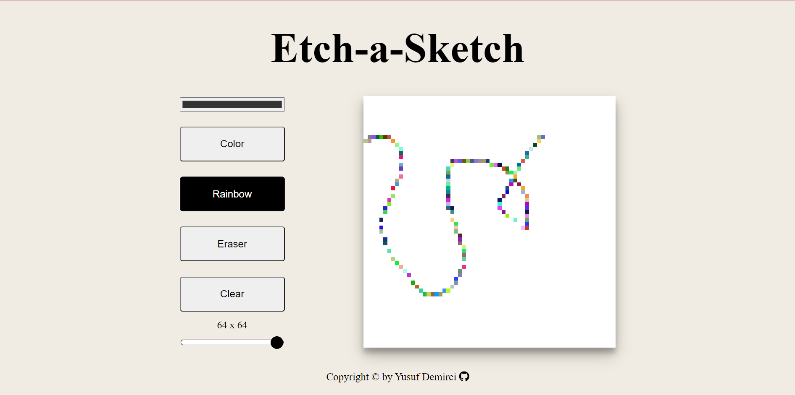

This is a sketch pad that's prepared by HTML-CSS and JavaScript. There are 3 modes you can use, color mode, where you can select any color from a color picker,
rainbow mode, where you can draw colorfully and randomly and last eraser mode. Also you can rearrange the resolution from 4x4 to 64x64.

# Etch-A-Sketch

## Overview

### The challenge

Users should be able to:

- View the optimal layout for the component depending on their device's screen size
- See hover states for all interactive elements on the page
- Use different color modes
- Use eraser mode
- Change the painting color and resolution

### Screenshot

### Links

- Live Site URL: [https://yusuf-demirci.github.io/Etch-A-Sketch/](https://yusuf-demirci.github.io/Etch-A-Sketch/)

### Built with

- Semantic HTML5 markup
- CSS custom properties
- Flexbox
- Mobile-first workflow
- JavaScript & JQuery

